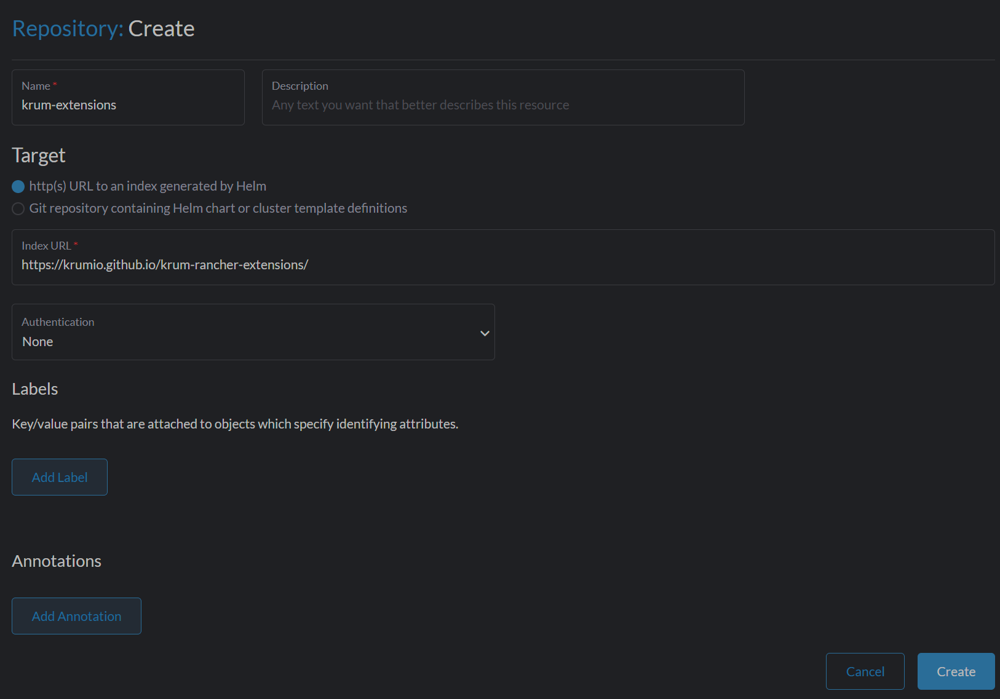

# Krum Rancher Extensions

This collection of Rancher extensions is designed to provide additional functionality to the Rancher dashboard, particularly to fill user-experience gaps for non-operator users.

## Platform Tools

### [App Launcher](./pkg/app-launcher/README.md)

Currently, if a user wants to access a software application running in Rancher/kubernetes, they need to dig deep into the services/ingress section in Rancher, or learn how to build the proxy URL on their own. Otherwise, operators need to use an ingress to create convenient access for users.

However, the proxy URL can be a powerful tool in Rancher. It allows a user with appropriate access to a namespaced resource to access that resource/application without ingress.

The App Launcher will expose a top-level directory of service/ingress objects, and will assemble proxy URLs. It will also provide an option to launch that ingress, if available.

## i18n

### [Pirate Locale (unreleased)](./pkg/pirate-locale/README.md)

This extension, for fun, is intended to demonstrate internationalization (i18n) for Rancher via Rancher extensions, as an homage to the Google search pirate translation from years ago.

This is currently unreleased, but will be available in the future. Contributions are welcome.

# Installation

To install the extension, you will need Rancher 2.7.6 or later.

1. Go to the Rancher dashboard (as an administrator)

2. Open the hamburger menu in the top left corner, and select Extensions


3. Open the dropdown in the top right corner and select "Manage Repositories"


4. Click Create

5. Enter the repository information

    a. Name: krum-extensions

    b. http(s) URL to an index generated by helm

    c. Index URL: `https://krumio.github.io/krum-rancher-extensions/`

    d. Authentication: None



6. Return to the Extensions page

7. Click the Available tab

8. Install the extensions you would like to install

Profit!

# Development

## Requirements

The extensions and the Rancher Dashboard code are currently built with Node 20.

We recommend managing node versions with [nvm](https://github.com/nvm-sh/nvm).

```sh
curl -o- https://raw.githubusercontent.com/nvm-sh/nvm/v0.39.3/install.sh | bash
cd # project directory
nvm install $(cat package.json | grep '\"node\": ' | grep -o '[0-9.]*')
```

When using nvm, you can use the following command to switch to the correct Node version:

```sh
  nvm use 20
```

<!-- verify if we actually need this.
### Yarn

We use [corepack](https://nodejs.org/api/corepack.html) (comes with Node.js) to manager our package manger's version. To install, run the following from the project's root directory.

```
corepack enable
``` -->

## Starting development

1. Clone this repository

2. Run `yarn install`

3. Run `API=<Rancher Backend base URL> yarn dev`

## Troubleshooting

### OpenSSL Error

You may encounter an error that appears like the following:
    
```   
  opensslErrorStack: [ 'error:03000086:digital envelope routines::initialization error' ],
  library: 'digital envelope routines',
  reason: 'unsupported',
  code: 'ERR_OSSL_EVP_UNSUPPORTED' }
```

If so, make sure you are using Node 20. Those with NVM can use the following command to switch to Node 20: `nvm use 20`.

## Misc

For more info, refer to the [rancher extensions prerequisites](https://extensions.rancher.io/extensions/next/extensions-getting-started#prerequisites).
